<div align="center">

# WinPanel

**A self-hosted control panel for websites, DNS, email and users on Windows Server 2025.**

Websites, Node and .NET apps, Cloudflare DNS, self-hosted mailboxes, customer accounts
and the Windows fixes that make it all work — in one panel, without IIS.

[Features](#what-it-does) · [Websites](#websites) · [DNS](#dns-control) · [Email](#email-control) · [People](#user-control-and-management) · [Compare](#how-it-compares) · [Live sites](#sites-running-on-it) · [FAQ](#frequently-asked-questions) · [Install](#installing) · [Support](#support) · [Licence](#licence) · [Develop](#development)

[](https://discord.gg/wT6mnfAnUD)

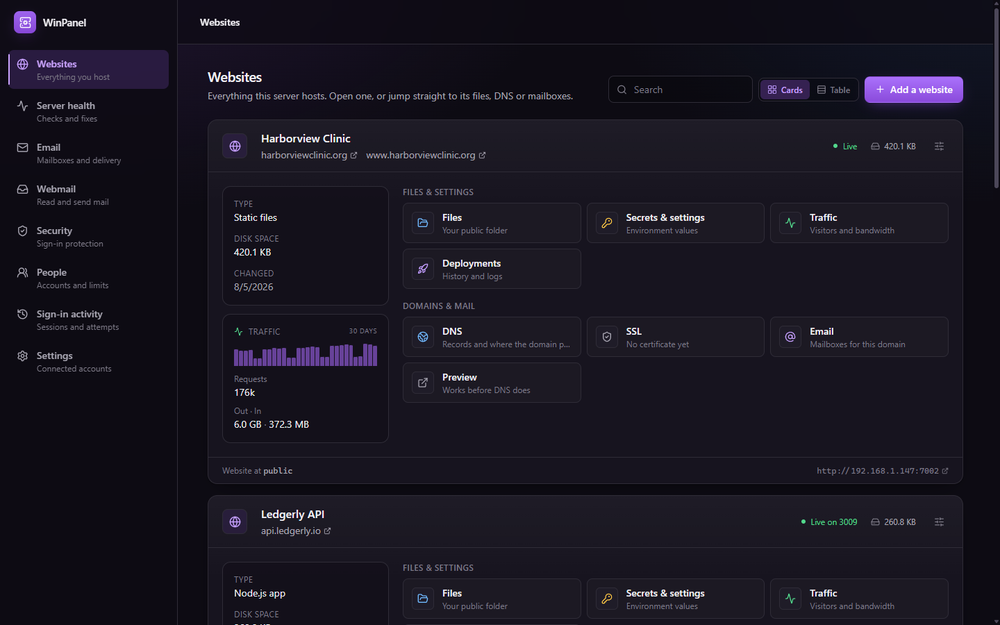

</div>

---

WinPanel is a free, self-hosted **web hosting control panel for Windows Server** — an
alternative to IIS, Plesk and cPanel for people running Node.js, ASP.NET Core and static
sites on Windows. Your apps run as ordinary Windows Services on loopback ports, and
**Caddy** sits in front handling HTTPS, domains and traffic. Mail is served by
**Stalwart**, DNS is driven through **Cloudflare**, and everything — websites,
certificates, mailboxes, customers and Windows itself — is managed from one web interface.

You reach the panel at **`https://<your-server-ip>:8443`** — no domain required.

> The screenshots on this page come from a real instance running the code in this
> repository. The domains, mailboxes, customers and traffic in them are invented.

---

## Why not IIS?

`iisnode`, the usual way of running Node under IIS, has not shipped a release in nine
years and still lists Windows Server 2012 as a prerequisite. Rather than build on that,
WinPanel runs each app as a supervised Windows Service and puts Caddy in front of them.

A practical consequence: **you never need a `web.config`.** That file is an IIS
artifact. The equivalent configuration here is generated for you — see
[Site configuration](#site-configuration) below.

---

## How it compares

Almost every modern hosting panel is Linux-only. That is the gap this fills.

| Panel | Runs on Windows | Node.js apps | Email | DNS | Cost |
| --- | --- | --- | --- | --- | --- |
| **WinPanel** | Server 2022 / 2025 | Supervised Windows Services, blue/green deploys | Stalwart, built in | Cloudflare, built in | Free, self-hosted |
| **IIS** | Built into Windows | Only through `iisnode`, unmaintained | No | No | Included |
| **Plesk for Windows** | Yes | Yes | Yes | Yes | Paid, per server |
| **aaPanel** | No — Linux only | Yes, on Linux | Yes | Yes | Free, paid Pro tier |
| **Webmin / Virtualmin** | No — Linux and Unix | By hand | Yes | Yes | Free, paid tiers |
| **CyberPanel, CloudPanel, HestiaCP** | No — Linux only | Varies | Varies | Varies | Free |

**IIS** is still the right answer for a plain ASP.NET application, and WinPanel leaves it
alone as long as it is not holding ports 80 and 443. What it does not give you is a way to
run a Node app, issue certificates, manage DNS, host mail, or hand a customer their own
login.

**Plesk** is the mature commercial option and does all of that. WinPanel is aimed at
people who want the same shape of thing without a per-server licence, and with Node
treated as a first-class runtime rather than an extension.

**aaPanel** is often suggested as the Windows answer, but that is the old BT Panel
Windows build. The current product describes itself as a Linux control panel and lists
only Linux distributions.

**Webmin and Virtualmin** are Unix tools — the official install instructions cover RHEL
and Debian derivatives, and most of the modules manage Linux subsystems that have no
Windows equivalent.

---

## What it does

| Area | Capability |
| --- | --- |
| **Websites** | Static files, Node and .NET apps, from Git or managed by hand |
| **Releases** | Builds off to one side and swaps it in, so a failed build never touches the live site |
| **HTTPS** | Free certificates, renewed automatically, using the DNS challenge |
| **DNS** | Cloudflare records per website, including the proxy toggle and a one-click "point this domain here" |
| **Email** | Self-hosted mailboxes with quotas and send-as aliases, MX/SPF/DKIM/DMARC checks, and webmail |
| **People** | Owner, administrator and customer accounts, each with website, disk and mail limits |
| **Security** | Two-factor sign-in, recovery codes, live sessions, failed-attempt log and automatic IP blocking |
| **Files** | Browse, upload, edit and download each site's files from the browser |
| **Server** | Detects and fixes the Windows settings that break Node hosting |
| **Recovery** | Notices an app that Windows thinks is stopped but whose old process is still running, ends it, and starts the app properly |

---

## Websites

Every website on the server, with its type, port, live status and 30 days of traffic at a
glance. Each card links straight to the parts of it you actually open: files, DNS, SSL,
mailboxes, traffic, deployments.


Switch to the table once there are more sites than fit on a screen — the same links, one
row each.

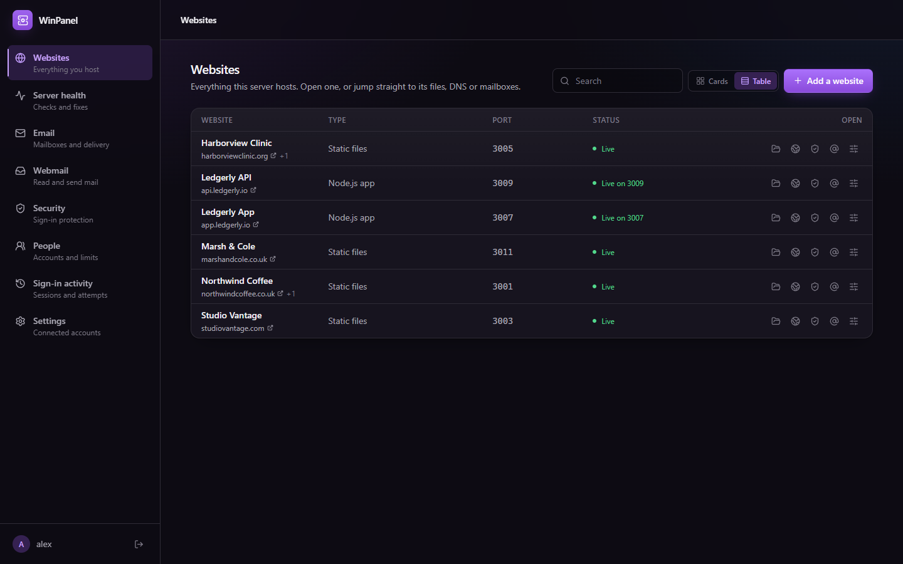

Node and .NET sites get a second port and a standby slot, so a deploy that fails to start
never takes the running app down with it.

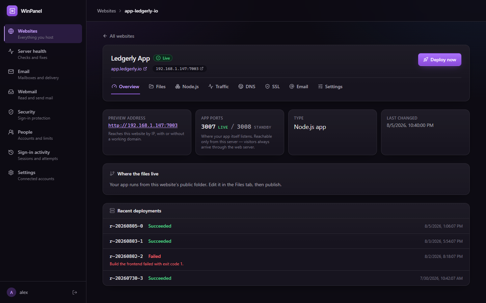

### Kinds of website

The panel asks one question first — what you are hosting — because it decides
everything after it.

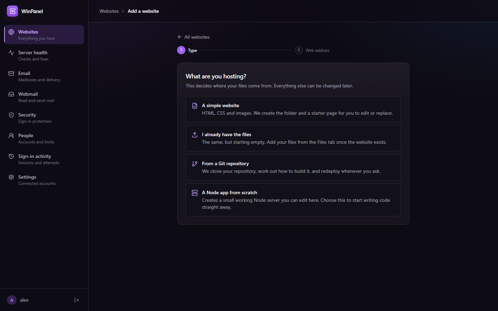

| Kind | What it does |
| --- | --- |
| **A simple website** | Creates the folder and a starter page. Edit or replace the files from the Files tab; changes are live immediately. |
| **I already have the files** | The same, starting empty. |
| **From a Git repository** | Clones your repository, works out how to build it, and publishes it to the site's `release` folder. |
| **A Node app from scratch** | Writes a small working Node server you can edit here. |

The first two, and the last, keep their files in the site's `public` folder.
Nothing the panel does ever overwrites that folder — it is yours. Only sites
built from Git use `release`, which *is* replaced on every deploy.

### Reaching a site before it has a domain

Every website gets a **preview address**, `http://<your-server-ip>:<port>`,
allocated from ports 7000–7999. It works the moment the site is created, with
no domain and no DNS. A web address is optional and can be added at any time.

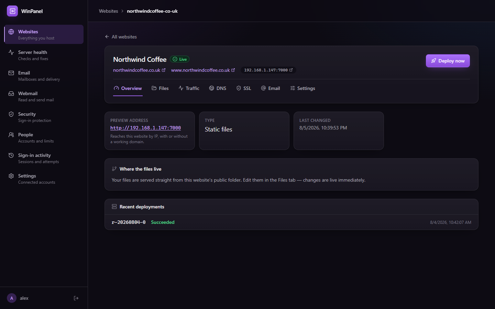

### Files

A real file manager: upload, edit, rename, copy, move, download, and a per-site disk quota
that is enforced rather than displayed. Every path is resolved and checked against the
site's own folder before anything is read or written.

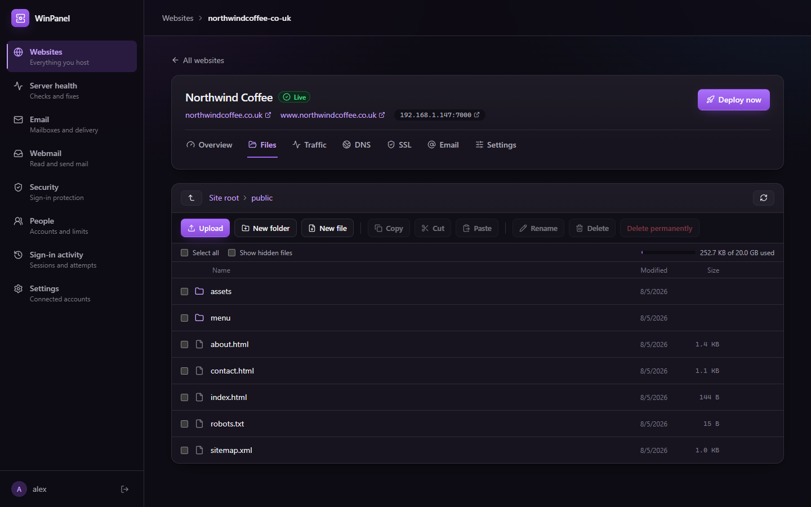

### Traffic

Requests, bandwidth in and out, response times and status-code mix, read from the web
server's own access logs — per website, per hour, for up to 90 days.

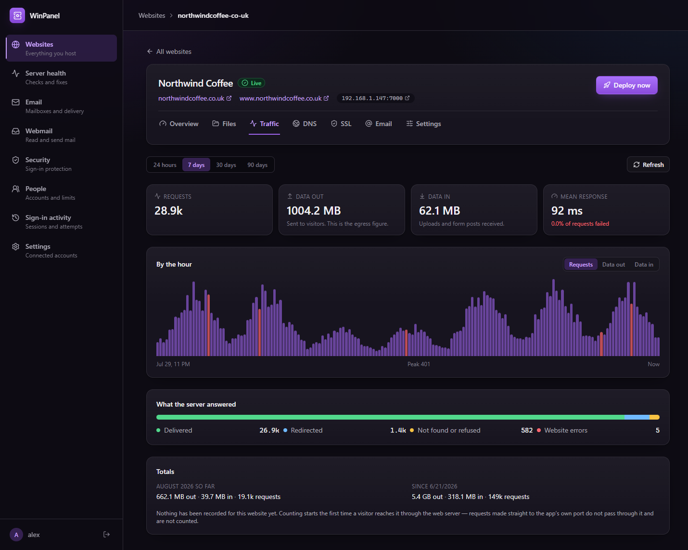

---

## DNS control

DNS is managed through Cloudflare, per website. A token is held **per site**, falling back
to a shared one, because a Cloudflare token only reaches the zones of the account that
issued it — and one server routinely hosts domains belonging to different people. Tokens
are encrypted in the vault and never leave the server; the browser only ever sees zone and
record data.

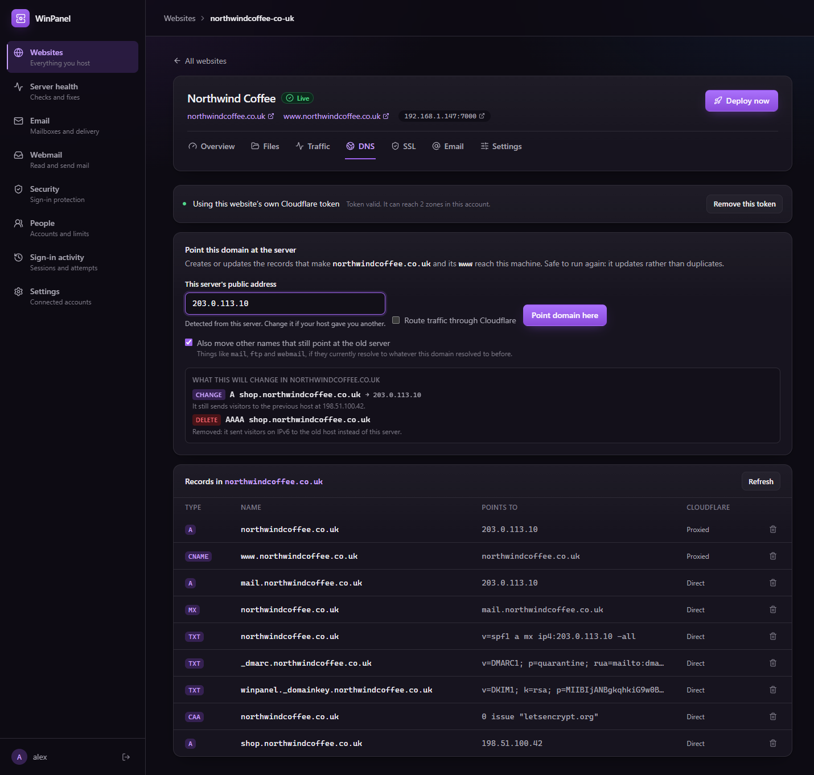

- **Point this domain here** — creates or updates the records that make the domain and its
  `www` reach this machine. It is safe to run again: it updates rather than duplicates.
- **A plan you approve first.** Before anything changes you are shown exactly what will be
  created, changed or deleted, and why. The preview and the mutation are produced by the
  same code, so what you approved is what runs.
- **Stale names are found for you.** Optionally, other names still pointing at your previous
  host — `mail`, `ftp`, `webmail`, `shop` — are moved across too, and IPv6 records left
  behind by the old server are removed.
- **Full record editing** for A, AAAA, CNAME, MX, TXT, CAA and more, with Cloudflare's proxy
  toggle exposed as a plain "Route traffic through Cloudflare" switch.
- **Certificates follow.** The same token drives the DNS-01 challenge, so HTTPS is issued
  and renewed without opening port 80 or waiting on propagation.

More detail in [docs/dns.md](docs/dns.md).

---

## Email control

Mailboxes belong to the website that owns the domain. The server-wide view lists every
domain, how many mailboxes it has and how much mail is stored.

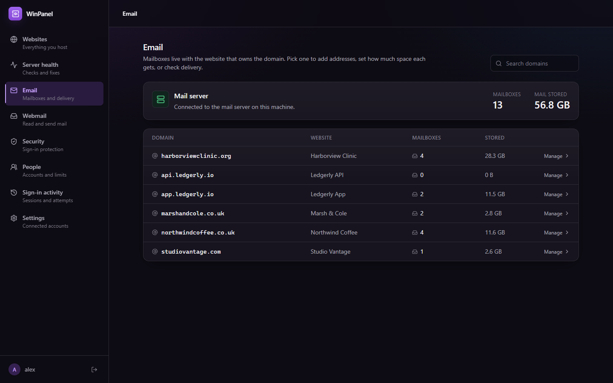

Open one and you get the mailboxes for that domain, each with a storage quota, aliases, a
password reset and a link straight into webmail.

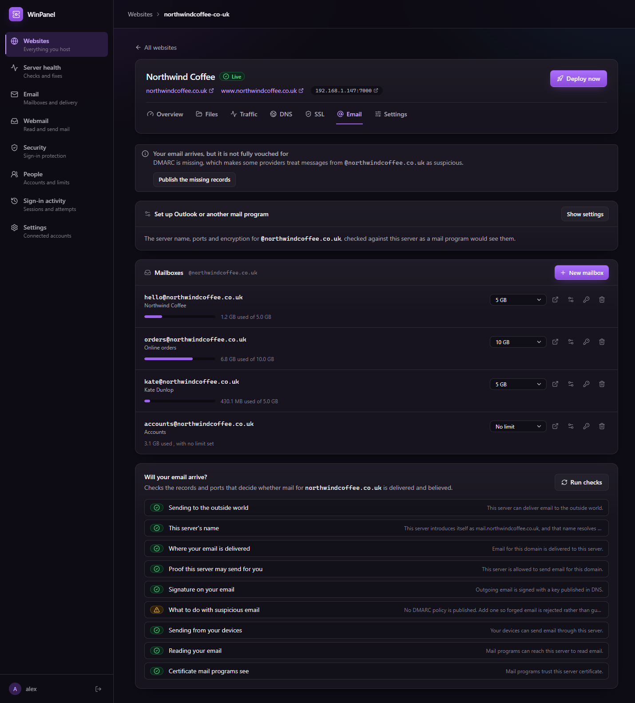

A mailbox can answer to more than one address. Add `noreply@` and `support@` as aliases of
`invoices@` and all three arrive in the same inbox — and, less obviously, an application
signed in as that one mailbox may send from any of them. Mail servers refuse a message
whose sender is not an address the account owns, so this is what a website needs when it
sends receipts from one address and password resets from another.

**Will your email arrive?** is the part that usually gets skipped. WinPanel checks the
things that decide whether mail is delivered *and believed*, and explains each one in
plain words:

| Check | What it proves |
| --- | --- |
| Sending to the outside world | Port 25 outbound is not blocked by your host |
| This server's name | The reverse DNS name matches and resolves back here |
| Where your email is delivered | MX points at this server |
| Proof this server may send | SPF authorises this server's IP |
| Signature on your email | DKIM is published and matches the signing key |
| What to do with suspicious email | A DMARC policy exists |
| Sending from your devices | Submission on 465/587 is reachable and encrypted |
| Reading your email | IMAP on 993 is reachable |
| Certificate mail programs see | The certificate at the mail port is one Outlook will trust |

The missing records can be published to Cloudflare in one click, and **Set up Outlook or
another mail program** shows the exact server names, ports and encryption — checked against
the running server, not copied from a template.

That last check matters more than it looks. Stalwart issues itself a self-signed
certificate on first start and never replaces it, which is why "webmail works but Outlook
does not" is such a common mail-server complaint. WinPanel copies the real certificate
Caddy obtained into the mail server, at startup and every six hours, so mail clients trust
it too. There is also a built-in webmail client, so a mailbox is usable the moment it
exists.

More detail in [docs/email.md](docs/email.md).

---

## User control and management

Three roles, because a hosting panel has three genuinely different jobs to do.

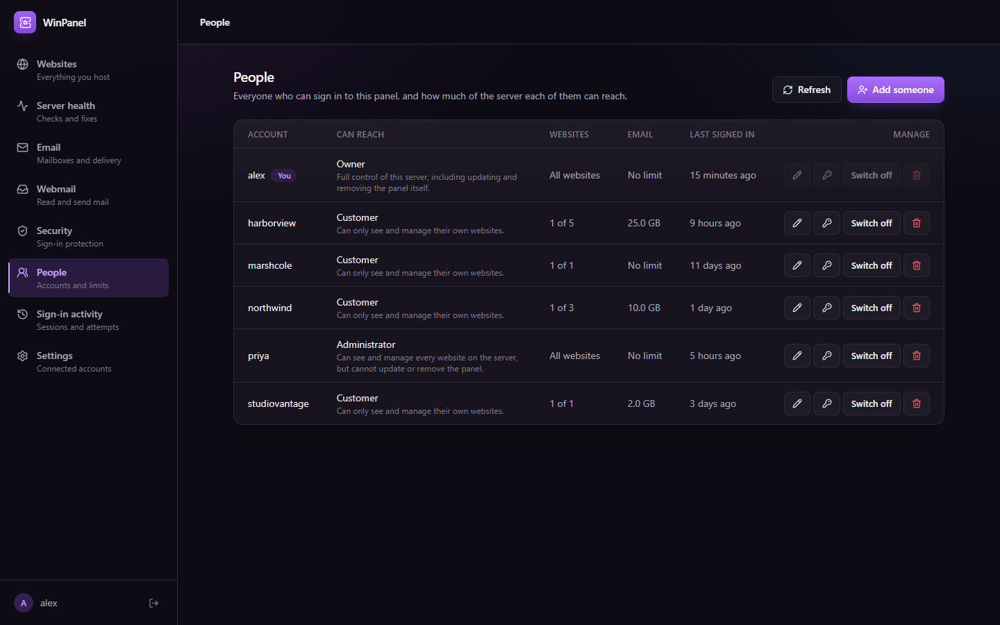

| Role | Can reach |
| --- | --- |
| **Owner** (`superadmin`) | Everything, including updating and removing the panel and reading the security trail |
| **Administrator** (`admin`) | Every website, mailbox and server setting — but not the panel's own lifecycle |
| **Customer** (`user`) | Only their own websites, files, DNS and mailboxes |

Each customer account carries its own limits: how many websites they may own, how much disk
each of their websites gets, and how much mail storage they may use in total. `No limit` is
a real setting, and so is zero.

Ownership is enforced in the API, not hidden in the interface. A customer cannot list
another customer's sites, cannot reach the shared Cloudflare token, and cannot see the
sign-in trail at all.

### Sign-in protection

Two-factor authentication with an authenticator app, printed recovery codes for when the
phone is gone, and a minimum password length of 12 characters — length weighted over
character-class rules, which only push people towards predictable substitutions.

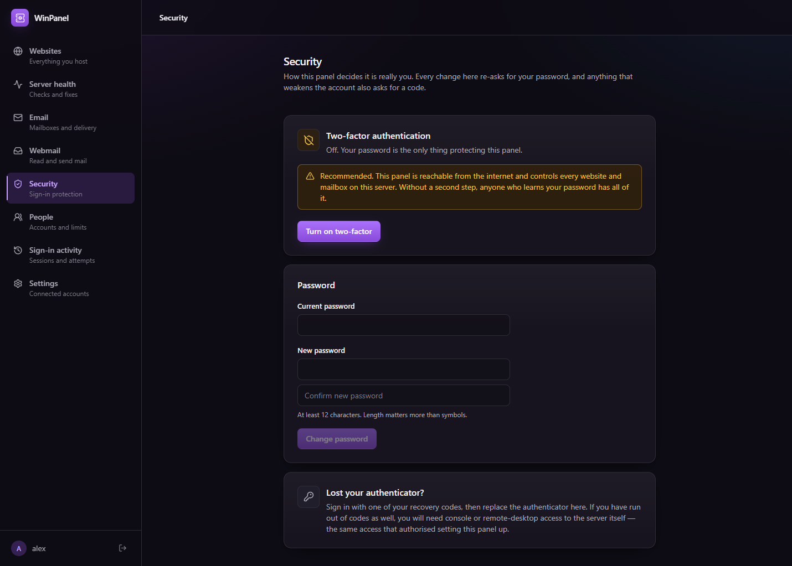

The owner also gets the whole picture: who is signed in right now, every failed attempt,
which addresses are being tried, and which are currently shut out. Repeated failures block
an address automatically; unblocking is one click, because a whole office usually shares
one address.

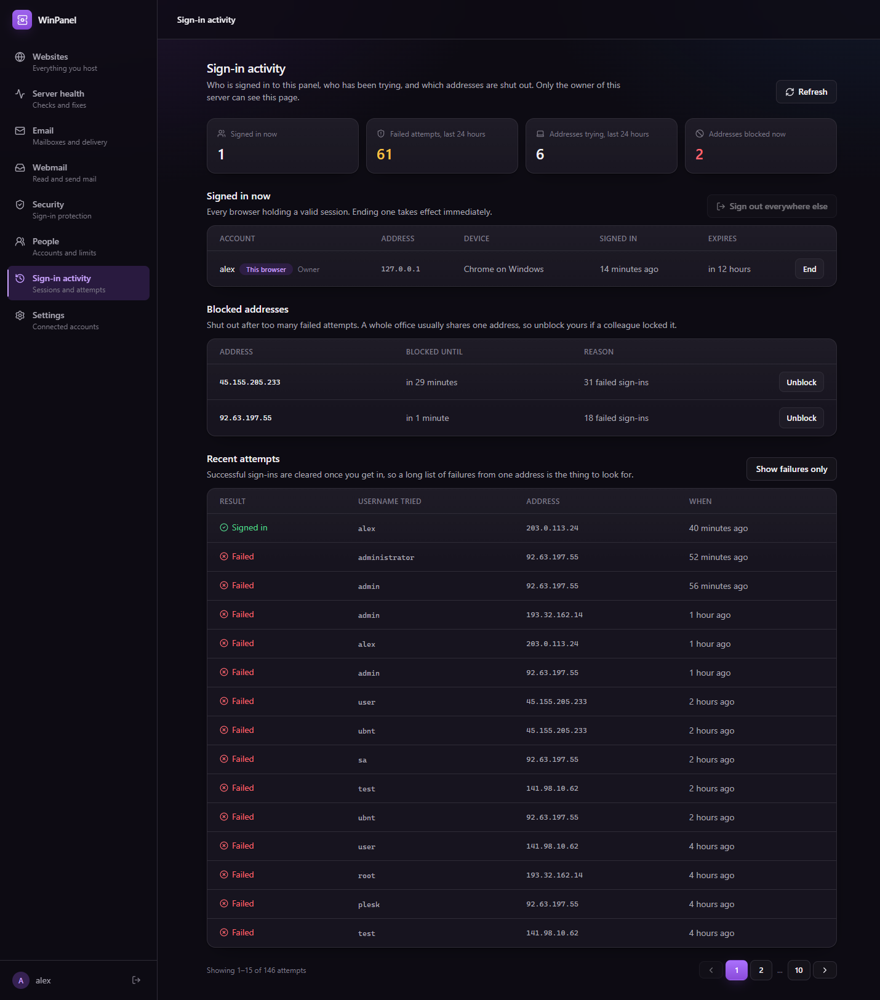

More detail in [docs/users-and-roles.md](docs/users-and-roles.md).

---

## Server health

Windows breaks Node hosting in a small number of specific, boring ways: IIS holding port
443, missing firewall rules, the time service stopped, long paths disabled. WinPanel checks
for them, explains the consequence, and fixes the safe ones itself.

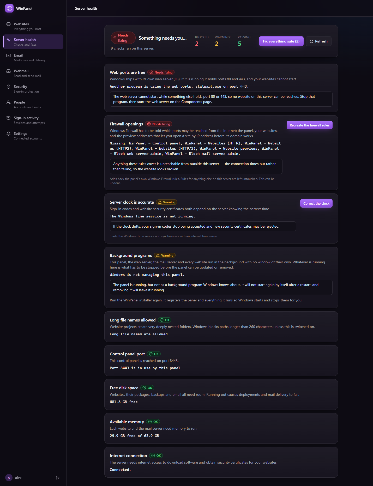

### Apps that fix themselves

Windows services have one failure mode that costs whole nights of downtime: the wrapper
supervising an app is killed without a clean stop — a sleep/wake cycle is the usual cause
— and the app underneath it keeps running. Windows reports the service as **stopped**
while the program is still there, still holding its port. Every restart then fails to
bind, and the service flaps until somebody signs in to the server and ends a process by
hand.

On a website it is worse than an outage, because nothing looks wrong. The old process
goes on answering Caddy, so the site stays up, while the panel reports it stopped and
every deploy lands on a process still running the code it was built from.

WinPanel checks for this every minute, and again whenever you press Start, Restart or
Stop, whenever a site is deployed, and before an update replaces any files. It ends the
leftover and starts the app properly.

It will not, ever, end a program that is not its own. Only a process holding one of the
service's own ports **and** running one of its own executables is touched — anything else
is named in the error so you can deal with it. And a stopped service with nothing
squatting on its port is left alone, because you stopped it on purpose.

---

## Sites running on it

WinPanel is not a demo. These are live sites hosted on it, sharing one Windows Server 2025
box, with their certificates, DNS records and deploys driven from the panel.

| Site | Kind | What it exercises |
| --- | --- | --- |
| [kitora.io](https://kitora.io) | Node app, deployed from Git | A commercial SaaS — time tracking, invoicing and Stripe payments. Blue/green deploys, so a bad build never reaches paying customers. |
| [diminished-studios.com](https://diminished-studios.com) | Node app, deployed from Git | A game studio site with accounts, Steam sign-in and leaderboards. |
| [taskbarlegends.com](https://taskbarlegends.com) | Node app with Socket.IO | Long-lived WebSocket connections through the reverse proxy, for a game's live player counts and match traffic. |
| [jean-kseafishing.com](https://www.jean-kseafishing.com) | Static site | The other end of the scale: plain HTML and images, uploaded through the file manager, no build step at all. |

Between them they cover every kind of site the panel supports, which is why the awkward
parts — WebSockets, `www` redirects, certificate renewal, a deploy that fails to start —
are handled rather than assumed.

---

## Requirements

- Windows Server 2025 (or Windows Server 2022)
- Administrator access
- A Cloudflare account, if you want managed DNS and automatic certificates

Nothing else needs to be installed first. The installer bundles its own Node runtime,
and the panel downloads everything else itself.

---

## Installing

1. Download `WinPanel-Setup-x64.exe` onto the server.
2. Run it. It creates the folders, registers the service, opens the firewall port and
   generates a certificate.
3. The final screen shows your panel URL and a **one-time setup code**.
4. Open the URL, enter the setup code, and create your account.

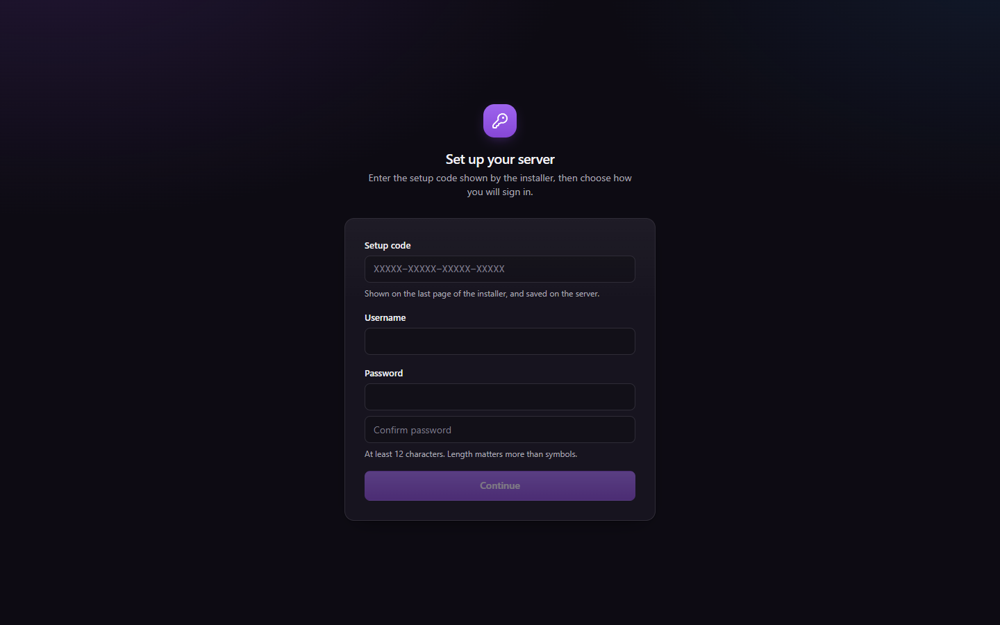

Two-factor is offered immediately, with recovery codes, and can be added later from the
Security page.

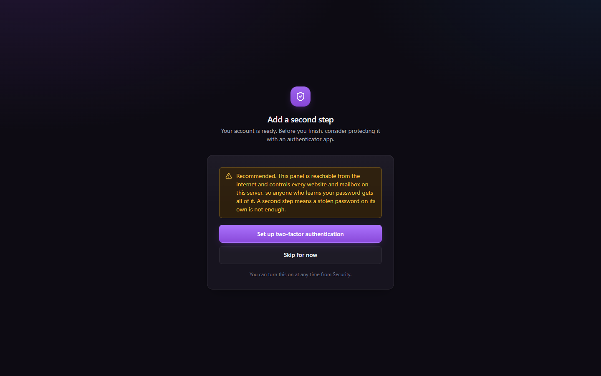

Your browser will warn about the certificate the first time. That is expected: the
panel uses a self-signed certificate because it is reached by IP address rather than a
domain name. The panel shows you the certificate's fingerprint so you can confirm you
are trusting the right one.

---

## Updating

New versions are published on the [releases
page](https://github.com/decerto/winpanel/releases), each with the installer and a
`SHA256SUMS.txt`. Nothing checks for them on your behalf, so subscribe to releases if you
want to be told about them.

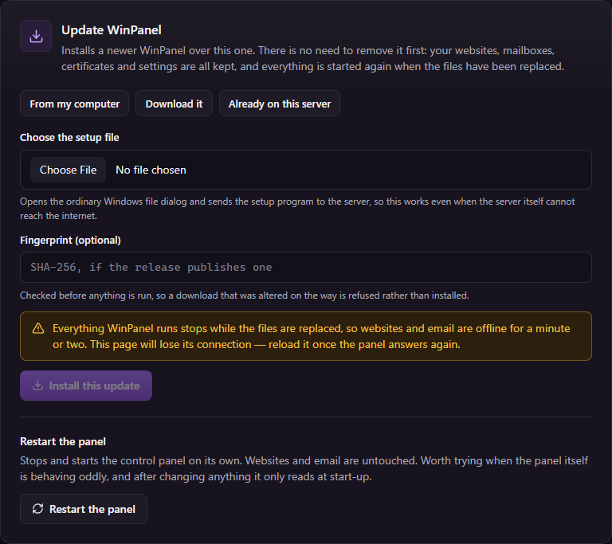

**From the panel.** Settings → **Update WinPanel** (the owner account only). Three ways in,
because servers differ:

| | For |
| --- | --- |
| **From my computer** | The normal case. Pick the setup file you downloaded and it is sent up to the server — so this works even when the server itself has no internet access. |
| **Download it** | Paste the `https://` link to the `.exe` on the release page and the server fetches it. |
| **Already on this server** | You have copied the file across yourself. Browse to it or paste the path. |

Paste the release's SHA-256 into the **Fingerprint** box if you want it checked. The
installer is fetched and proved to be a Windows program *before* anything is stopped, so a
bad download leaves you with a running panel rather than a dead one.

Then it stops every WinPanel service, replaces the program files and starts everything
again. Websites and email are **offline for a minute or two**, and the page you are
watching will lose its connection — reload it once the panel answers. What it did is
written to `C:\WinPanel\logs\winpanel-update.log`.

**From the server.** Downloading the new `WinPanel-Setup-x64.exe` and running it over the
top does exactly the same thing. That is the fallback if the panel is too broken to update
itself.

Either way it is an upgrade in place, not a reinstall: your websites, mailboxes,
certificates, users, settings and history are all kept, and you stay signed in. The
version you are on is shown at the top of the Settings page.

> There is no rollback. Updates go forward only, so take a copy of
> `C:\WinPanel\data\panel.db` and `C:\WinPanel\data\vault.key` first — see
> [DEPLOYMENT.md](DEPLOYMENT.md#what-to-back-up).

How the mechanism works, and why the installer is run by the Windows task scheduler rather
than by the panel, is in [docs/updating.md](docs/updating.md).

---

## Repository layout

```
apps/
  agent/          The service that runs on the server: API, jobs, deployments
  panel/          The Vue 3 web interface
packages/
  shared/         Types and validation shared by both, defined once
  installer/      The Inno Setup installer and its staging scripts
docs/             Developer documentation
```

TypeScript end to end: Fastify and tRPC in the agent, Vue 3 with Vite and Tailwind in the
panel, SQLite through Drizzle for storage. What each module in the agent is responsible for
is listed in [docs/architecture.md](docs/architecture.md).

---

## Site configuration

Sites built from Git get a `winpanel.json` describing how to build and run
them. The panel works this out by looking at your project and asks you to
confirm; you can commit the file so later deploys need no setup at all.
(Sites you manage by hand have no build, so there is nothing to configure.)

A repository with a `frontend/` and a `backend/`, where the frontend builds into the
backend and the backend serves it, is detected automatically and produces:

```json
{
  "runtime": "node",
  "packageManager": "pnpm",
  "steps": [
    { "name": "Install frontend packages", "cwd": "frontend", "command": "pnpm", "args": ["install"] },
    { "name": "Build the frontend",        "cwd": "frontend", "command": "pnpm", "args": ["run", "build"] },
    { "name": "Install backend packages",  "cwd": "backend",  "command": "pnpm", "args": ["install", "--prod"] }
  ],
  "app": { "cwd": "backend", "portEnvVar": "PORT", "healthCheckPath": "/" },
  "spaFallback": false
}
```

`command` is restricted to a known set of tools (`npm`, `pnpm`, `yarn`, `bun`, `node`,
`npx`, `dotnet`). Anything custom belongs in a `package.json` script, which those tools
then run — this file is read from your repository, so it is treated as untrusted input.

---

## Ports

| Port | Used by | Reachable from |
| --- | --- | --- |
| 8443 | The control panel | Anywhere |
| 80, 443 | Your websites | Anywhere |
| 25, 465, 587, 993, 995 | Email | Anywhere |
| 7000–7999 | Website previews | Anywhere |
| 2019 | Web server admin | This machine only |
| 8080 | Mail server admin | This machine only |
| 3001+ | Your apps | This machine only |

Port 8443 is permanently reserved, so a site can never be given it.

---

## Frequently asked questions

### Can I host a Node.js app on Windows Server without IIS?

Yes — that is the point of it. Each app runs as a supervised Windows Service on a
loopback port, and Caddy reverse-proxies your domain to it. No IIS, no `iisnode`, no
`web.config`.

### Should I still use iisnode?

It has not had a release in nine years and still lists Windows Server 2012 as a
prerequisite. If you are starting something today, run Node as a service behind a reverse
proxy instead. That is what WinPanel automates.

### Do I have to uninstall IIS?

No. IIS only has to stop holding ports 80 and 443. The Health page detects that and offers
to stop and disable it for you — reversibly, since it records the previous start mode
first, so a machine that genuinely used IIS can be put back the way it was.

### Is there a free alternative to Plesk or cPanel for Windows?

That is what this is. It covers the same ground — websites, domains, SSL, mail, file
manager, customer accounts — self-hosted, with no licence fee.

### Does aaPanel work on Windows?

Not any more. The Windows edition people remember is the older BT Panel build. aaPanel now
describes itself as a Linux control panel and supports Ubuntu, Debian, CentOS, AlmaLinux
and Rocky.

### Does Webmin run on Windows?

Webmin is a Unix tool. Its installation instructions cover RHEL and Debian derivatives,
and its modules configure Linux services, so a Windows box is not a supported target.

### Does it support PHP or WordPress?

Not yet. WinPanel hosts static sites, Node.js apps and .NET apps today. PHP support is
planned, and WordPress with it.

### Does it work with ASP.NET Core?

Yes. A .NET site is published, run through Kestrel as a service, and proxied the same way
a Node app is — including the standby slot, so a failed deploy never takes the running app
down.

### What Windows versions does it need?

Windows Server 2025 or 2022. It has not been tested on 2019 or on desktop Windows.

### Do I need a domain name to start?

No. Every website gets a preview address on `http://<your-server-ip>:<port>` the moment it
is created, and the panel itself is reached by IP. Domains can be added later.

### Do I have to use Cloudflare?

No. Cloudflare is what makes DNS records manageable *from the panel*, and it is what
lets certificates be issued over the DNS challenge — including for domains that are not
pointing here yet. Without a token, a domain simply falls back to Caddy's own challenge
over port 80, which works as long as the domain already resolves to the server. You just
edit the DNS records yourself, wherever they live.

### If the panel stops, do my websites go down?

No. Caddy and each app are separate Windows Services. The panel configures and supervises
them; it is not in the request path. Restarting or updating it does not interrupt traffic.

### What happens if an app crashes or gets stuck?

Each app is a supervised Windows Service, so a crash restarts it. The harder case — the
supervisor dying and leaving the app running, so the service reads as stopped and can
never start again because its own old process still holds the port — is checked for every
minute and cleared automatically. See [Apps that fix themselves](#apps-that-fix-themselves).

### Does it support WebSockets and Socket.IO?

Yes, with nothing to configure. Caddy upgrades and proxies the connection to your app on
its loopback port. [Taskbar Legends](https://taskbarlegends.com) is a Socket.IO game
hosted this way.

### Can I give clients their own logins?

Yes. Customer accounts see only the websites assigned to them, with limits on how many
sites, how much disk and how much mailbox storage they get. Ownership is enforced on the
server for every request, not hidden in the interface.

### Can I really host email on it?

Yes — Stalwart, with mailboxes, aliases, quotas, DKIM signing and webmail. One mailbox can
receive and send as several addresses, which is what an application needs when it sends
from more than one. The panel checks your MX, SPF, DKIM, DMARC, PTR and certificate for
each domain and tells you which one is wrong. Do check that your host does not block port
25 outbound first.

### How is this different from installing Caddy myself?

It is not, for one site. The work it saves is everything around it: allocating ports,
registering and supervising services, blue/green deploys, certificates, DNS records,
mailboxes, quotas, customer accounts and the Windows settings that quietly break Node
hosting.

### Is it production ready?

It runs real sites — [see which](#sites-running-on-it) — but it is young. Take backups,
read the release notes before updating, and report anything that surprises you.

### Can I use it for my business?

Yes. Host your own sites on it, host your clients' sites on it, give those clients their
own logins, and charge them whatever you like. None of that needs permission or a fee.

What you may not do is sell WinPanel itself, or repackage it as your own control panel —
even a free one. See [Licence](#licence).

### Is it open source?

The source is here, and you may read it, change it, run it and share it. But it is not
open source in the OSI sense, because one use is withheld: building something that
substitutes for WinPanel. The full terms are in [LICENSE.md](LICENSE.md).

---

## Development

```bash
pnpm install
pnpm build         # build every package
pnpm test          # run all tests
pnpm typecheck     # type-check every package
pnpm check         # build + typecheck + test
```

The agent stores its data under `C:\WinPanel` and sites under `C:\Sites`. During
development set `WINPANEL_ROOT` and `WINPANEL_SITES_ROOT` to keep everything in a
scratch folder instead — [docs/development.md](docs/development.md) walks through it.

### Documentation

| Document | What is in it |
| --- | --- |
| [docs/architecture.md](docs/architecture.md) | How the agent, panel, Caddy and Stalwart fit together |
| [docs/development.md](docs/development.md) | Running the panel locally, environment variables, gotchas |
| [docs/dns.md](docs/dns.md) | Cloudflare tokens, the record planner, certificate issuance |
| [docs/email.md](docs/email.md) | Stalwart, JMAP, mailboxes, aliases, DKIM and the certificate sync |
| [docs/users-and-roles.md](docs/users-and-roles.md) | Roles, limits, ownership checks, sessions and IP bans |
| [docs/updating.md](docs/updating.md) | How the panel updates itself in place |
| [docs/testing.md](docs/testing.md) | Testing conventions, including the adversarial ones |

---

## Support

**[Ask on Discord](https://discord.gg/wT6mnfAnUD)** — the quickest way to get help, and
where setup questions, "is this meant to happen", and release announcements go.

For anything that needs a paper trail — a reproducible bug, or a feature you want
remembered — [open an issue](https://github.com/decerto/winpanel/issues) instead, and
include your WinPanel version, your Windows build and the exact wording the panel gave
you.

Security vulnerabilities go to neither. See [SECURITY.md](SECURITY.md).

---

## Licence

[PolyForm Perimeter 1.0.1](LICENSE.md). Free to use, free to change, free to pass on —
with one line drawn around it.

| | |
| --- | --- |
| **Yes** | Run it on as many servers as you like, at home or at work |
| **Yes** | Host your own sites on it, and your clients' sites, and charge them for it |
| **Yes** | Change it, fork it, and share your changes |
| **Yes** | Charge for setting it up, running it, or supporting it for someone else |
| **No** | Sell WinPanel, or licence it, or bundle it into something you sell |
| **No** | Rebrand it and offer it as your own control panel — free or paid |

The short version: **you can make money *with* it, but not *from* it.** It is given away
so that people who need it have it, not so that somebody else can put a price on it.

This means WinPanel is source-available rather than open source: everything an open source
licence permits is permitted here, except building a substitute for the thing itself.

The copyright holder keeps every right in the software and may license it on other terms,
so a commercial licence can be asked about — [on Discord](https://discord.gg/wT6mnfAnUD) —
if your plans need one.

Contributions are accepted under the terms in [CONTRIBUTING.md](CONTRIBUTING.md), and the
third-party components WinPanel uses are recorded in
[THIRD-PARTY-NOTICES.md](THIRD-PARTY-NOTICES.md). Nothing bundled in the installer is
under a copyleft licence; the two copyleft programs the panel can install for you —
Stalwart and Git — are downloaded from their own publishers and run as separate
processes, which that file explains.

GitHub will not show a licence badge for this repository. PolyForm Perimeter is not an
OSI-approved licence, so GitHub's detector reports it as "other" — that is expected, not a
missing file.

---

## Contributing

Bug reports, feature requests and pull requests are welcome — see
[CONTRIBUTING.md](CONTRIBUTING.md). Security issues should not be filed as public issues;
[SECURITY.md](SECURITY.md) explains how to report them.
